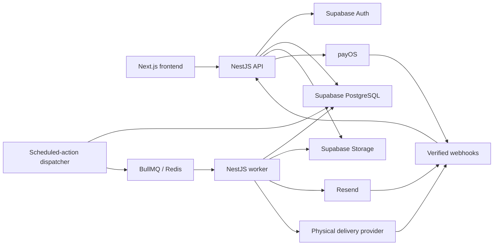

# PostDrop Backend Architecture

Status: proposed architecture for the production rewrite  
Scope: backend only; the current in-memory prototype is not a constraint

## 1. Executive decision

Build PostDrop as a TypeScript modular monolith with two runtime processes:

1. A NestJS HTTP API for users, payments, drafts, and webhooks.
2. A NestJS worker for scheduled actions, delivery, retries, and reconciliation.

Use PostgreSQL as the source of truth for every future action. Do not create a
queue timer that is expected to remain alive for several years. A database row
must record what needs to happen and when; workers only execute actions that
have become due.

The initial stack is:

| Area | Choice |
| --- | --- |
| Runtime | TypeScript on the current Node.js LTS |
| API | NestJS REST API with generated OpenAPI documentation |
| Architecture | Modular monolith |
| Database | Supabase PostgreSQL |
| Database access | `@supabase/supabase-js` |
| Schema migrations | Supabase CLI and SQL files in `supabase/migrations/` |
| Seed data | `supabase/seed.sql` |
| Authentication | Supabase Auth |
| File storage | Supabase Storage using private buckets |
| Long-term scheduling | PostgreSQL `scheduled_actions` table |
| Background queue | BullMQ |
| Queue storage | Redis |
| Email | Resend |
| Vietnam payments | payOS behind a provider interface |
| Physical delivery | Carrier adapter for GHN, GHTK, or Viettel Post |
| Error monitoring | Sentry |
| Logging | Pino structured JSON logs |
| Tests | Jest, Supertest, Testcontainers, and Playwright |

Supabase owns the database lifecycle. Prisma, Kysely, and other ORMs are not
part of the initial stack. NestJS uses the Supabase JavaScript client for normal
queries and calls PostgreSQL functions through `supabase.rpc()` for atomic
operations that require locking or multi-table transactions.

PostgreSQL remains the durable source of truth for delivery dates. BullMQ and
Redis handle work that is ready to run, retries, backoff, and concurrency; Redis
does not hold the only record of a future delivery.

## 2. High-level architecture



The API and worker should live in the same repository and import the same domain
packages, but deploy as separate processes. This permits independent scaling and
failure isolation without the operational cost of microservices.

Suggested structure:

```text
backend/
  apps/
    api/
    worker/
  packages/
    config/
    database/
    domain/
    encryption/
    providers/
  docs/
supabase/
  migrations/
  seed.sql
```

The folder migration does not need to happen all at once. The same separation
can initially be represented by NestJS modules inside `src/`.

## 3. NestJS modules

Use the following bounded modules:

- `AuthModule`
- `UsersModule`
- `GuestSessionsModule`
- `DraftsModule`
- `LettersModule`
- `SealingModule`
- `AttachmentsModule`
- `PaymentsModule`
- `SchedulingModule`
- `DeliveriesModule`
- `NotificationsModule`
- `FulfillmentModule`
- `WebhooksModule`
- `AuditModule`
- `AdminModule`

Modules may call each other through application services. They should not reach
directly into another module's Supabase repository.

## 4. Core data model

The initial production schema should include:

| Table | Purpose |
| --- | --- |
| `users` | PostDrop profile linked to a Supabase Auth user |
| `guest_sessions` | Signed guest identity before registration |
| `letters` | Non-secret metadata and immutable content state |
| `letter_contents` | Encrypted-content location, checksum, and key metadata |
| `attachments` | Encrypted attachment metadata and object paths |
| `recipients` | Recipient contact and delivery information |
| `orders` | Server-calculated product and amount |
| `payments` | Provider references and payment state |
| `physical_orders` | Physical mode, expected arrival, internal deadlines, and fulfillment state |
| `scheduled_actions` | Durable future actions |
| `delivery_attempts` | Every attempted email or physical delivery |
| `physical_shipments` | Carrier, tracking code, and fulfillment status |
| `webhook_events` | Deduplication and audit record for provider callbacks |
| `outbox_events` | Transactional handoff from domain changes to workers |
| `audit_events` | Security-sensitive and operational state transitions |

Do not use one status field to represent the entire product. Maintain separate
state machines:

```text
Letter content:
DRAFT -> SEALED

Payment:
PENDING -> PAID -> REFUNDED
        \-> FAILED

Digital release:
PLANNED -> AVAILABLE -> OPENED
        \-> FAILED

Email notification:
PENDING -> PROCESSING -> SENT -> DELIVERED
                    \-> RETRYING -> FAILED
                               \-> BOUNCED

Printed-design fulfillment:
PLANNING -> READY_TO_PRINT -> PRINTED -> QUALITY_CONTROL
-> READY_TO_DISPATCH -> DISPATCHED -> DELIVERED
                                     \-> FAILED

Stored-original fulfillment:
AWAITING_INTAKE -> RECEIVED -> IN_CUSTODY -> READY_TO_DISPATCH
-> DISPATCHED -> DELIVERED
              \-> FAILED
```

Delivery method is exclusive: `digital` or `physical`. Physical delivery then
selects `print_design` or `stored_original`. Sealing makes content or order
details immutable; it does not by itself mean that fulfillment is scheduled or
complete. Physical fulfillment state belongs to `physical_orders`, not to the
letter content record.

## 5. Date and timezone rules

Store all of the following:

- The expected-arrival calendar date selected by the user.
- The user's IANA timezone, for example `Asia/Ho_Chi_Minh`.
- The intended local expected-arrival time.
- The immutable expected-arrival UTC timestamp.
- For physical orders, separately calculated production and dispatch deadlines.

Do not reconstruct an expected-arrival timestamp later from the server's
timezone.

When the user seals a letter, calculate and persist the immutable delivery
promise. Digital release may be scheduled at that instant. Physical production
and dispatch must be calculated backwards from expected arrival using the
selected carrier service, holidays, production lead time, and safety buffers.
Until those authoritative deadlines exist, keep the physical order in planning
or awaiting-intake state and create no prematurely timed fulfillment action. If
the user is allowed to change the expected arrival later, represent that as a
separately audited operation rather than silently editing the sealed record.

## 6. Reliable future scheduling

Use a durable table:

```text
scheduled_actions
- id
- letter_id
- action_type
- execute_at
- status
- attempt_count
- max_attempts
- next_attempt_at
- idempotency_key
- locked_at
- locked_by
- completed_at
- last_error_code
- created_at
- updated_at
```

Example action types:

- `SEND_ADDRESS_CONFIRMATION`
- `SEND_CONTACT_REMINDER`
- `DELIVER_EMAIL`
- `CREATE_PRINT_ORDER`
- `CHECK_EMAIL_DELIVERY`
- `CHECK_PHYSICAL_DELIVERY`

Use a PostgreSQL function such as `claim_due_scheduled_actions()` for the atomic
claim operation. The function belongs in `supabase/migrations/` and uses
`FOR UPDATE SKIP LOCKED`. NestJS calls it through `supabase.rpc()` so the
locking and state transition occur inside PostgreSQL rather than being
reimplemented in application code.

The scheduling pipeline is:

1. The dispatcher calls the RPC function to claim due actions.
2. The same database transaction creates an `outbox_events` row for every
   claimed action.
3. The outbox relay adds each event to BullMQ with the action's idempotency key
   as the BullMQ `jobId`.
4. A BullMQ worker executes the external side effect.
5. The worker records the provider response in `delivery_attempts`.
6. BullMQ retries transient failures with exponential backoff.
7. The worker marks exhausted actions `FAILED` and records the final error.

Start with these queues:

| Queue | Jobs |
| --- | --- |
| `delivery` | Email delivery and delivery-status checks |
| `notifications` | Address confirmation and contact reminders |
| `documents` | Letter rendering and print-ready PDF generation |
| `fulfillment` | Physical print and carrier handoff |
| `webhooks` | Deferred provider-webhook processing |

Redis stores active BullMQ jobs and retry state. PostgreSQL still stores the
canonical schedule, action state, provider attempts, and audit history. This
allows the queue to be rebuilt from PostgreSQL if Redis is cleared.

Use a persistent Redis instance with `maxmemory-policy=noeviction`. Run Redis
locally through Docker for development and use a managed Redis-compatible
service for the deployed demo.

NestJS provides the `@nestjs/bullmq` integration used by the API, dispatcher,
and worker:
[NestJS queue documentation](https://docs.nestjs.com/techniques/queues).

Add a separate reconciliation task. It must search for:

- Actions overdue but still pending.
- Actions locked for longer than the worker timeout.
- Provider requests with no final webhook.
- Letters whose delivery date passed without a successful delivery.

This reconciler is the safety net if a process crashes between an external API
call and a database update.

## 7. Supabase Storage design

Create private buckets:

| Bucket | Contents |
| --- | --- |
| `draft-attachments` | Temporary images belonging to editable drafts |
| `sealed-letters` | Encrypted canonical letter payloads |
| `sealed-attachments` | Encrypted canonical attachment payloads |
| `generated-documents` | Encrypted print-ready PDF files and receipts |

Never use a public bucket for letter content. Supabase private buckets enforce
access through RLS or short-lived signed URLs:

- [Supabase Storage access control](https://supabase.com/docs/guides/storage/security/access-control)
- [Supabase private buckets](https://supabase.com/docs/guides/storage/buckets/fundamentals)

Object paths must use opaque IDs rather than names or email addresses:

```text
sealed-letters/{letter_id}/{content_version_id}.bin
sealed-attachments/{letter_id}/{attachment_id}.bin
```

### RLS policy intent

- Users may upload and read only their own draft attachments.
- Users cannot read sealed letter or sealed attachment objects.
- Authenticated clients cannot update, overwrite, or delete sealed objects.
- Only the backend service role can create or retrieve sealed objects.
- The service-role key exists only in backend secret storage and is never sent
  to the browser.

The service role bypasses RLS. Consequently, RLS is not a replacement for
encryption, internal authorization, or backups.

### Simulated immutability

Supabase Storage does not provide S3 Object Lock semantics. Implement
application-level append-only behavior:

1. Generate a new random object path for every sealed content version.
2. Upload without `upsert`.
3. Save a SHA-256 checksum, byte length, and MIME type in PostgreSQL.
4. Never expose update or delete operations for sealed buckets.
5. Record every service-role access in `audit_events`.
6. Verify the checksum before delivery.

This protects against application mistakes but does not prevent a Supabase
administrator or leaked service-role key from deleting an object. The product
must not describe this as WORM or compliance-grade immutable storage.

## 8. Content encryption

Private buckets and RLS are necessary but insufficient. Encrypt letter content
and attachments in the backend before uploading them.

For this project:

- Use authenticated encryption such as AES-256-GCM from Node's standard
  `crypto` module.
- Generate a random data-encryption key and nonce for each sealed letter.
- Store only ciphertext in Supabase Storage.
- Store the encrypted data key, algorithm version, nonce, checksum, and object
  path in `letter_contents`.
- Store the master key only in the API/worker deployment's secret manager.
- Never log plaintext, keys, request bodies containing content, or signed URLs.

Key rotation must be versioned. Keep `key_version` on every encrypted record so
old content remains decryptable during a rotation.

For the first MVP, the API may need encryption access because users edit
server-side drafts. As the system matures, separate permissions so only the
sealing and delivery worker can decrypt sealed content.

PostDrop cannot truthfully claim that its system is technically incapable of
reading a letter: the delivery worker must decrypt it to create an email or
print document. A defensible promise is:

> Sealed letters are encrypted and unavailable through the customer dashboard,
> support tools, and ordinary administrative workflows. They are decrypted only
> by the automated delivery process when required.

## 9. Guest writing and account claiming

PostDrop should continue allowing users to write before creating an account:

1. Create a signed guest-session identifier.
2. Store it in an `HttpOnly`, `Secure`, `SameSite=Lax` cookie.
3. Autosave drafts under the guest session.
4. Ask the user to verify an email during checkout.
5. Atomically transfer the draft to the verified Supabase Auth user.
6. Expire abandoned guest sessions and attachments after a documented period.

Apply request throttling to guest draft creation and attachment uploads.

## 10. Payments and sealing

Implement a `PaymentProvider` interface so payOS can be replaced or supplemented
without changing the letter domain.

The browser is not authoritative for price or payment success:

1. The backend calculates the product, price, and currency.
2. The backend creates the order and payOS payment request.
3. The user completes payment.
4. The backend verifies the signed payOS webhook.
5. A unique provider event ID prevents duplicate processing.
6. The backend confirms the amount, currency, and order reference.
7. The sealing transaction changes the letter state and creates all required
   `scheduled_actions`.

A successful browser redirect must never mark an order as paid.

Official payOS documentation describes payment links and webhook confirmation:
[payOS documentation](https://payos.vn/docs/).

## 11. Email delivery

Use Resend initially behind an `EmailProvider` interface.

For every send:

- Use a stable PostDrop idempotency key.
- Persist the provider message ID.
- Do not include plaintext letter content in application logs.
- Verify webhook signatures.
- Store and deduplicate webhook event IDs.
- Handle webhooks as at-least-once and potentially out of order.
- Track `sent`, `delivered`, `delayed`, `bounced`, and `complained` separately.

Resend supports provider-side idempotency keys, but the documented
deduplication window is limited. PostDrop's `delivery_attempts` unique constraint
must provide permanent duplicate-send protection.

References:

- [Resend idempotency keys](https://resend.com/docs/dashboard/emails/idempotency-keys)
- [Resend webhook behavior](https://resend.com/docs/webhooks/introduction)

## 12. Physical delivery

Keep carrier-specific behavior behind a `ShippingProvider` interface:

```text
createShipment()
getLabel()
getTrackingStatus()
cancelShipment()
verifyWebhook()
```

Physical fulfillment also needs an internal operations flow:

- Address confirmation 30 days before delivery.
- Print-ready PDF generation.
- Human print and packaging queue.
- Quality-control confirmation.
- Carrier label creation.
- Tracking-code recording.
- Failed-delivery and returned-mail handling.

An operations user must never receive database or Supabase service-role access.
Expose only the minimum required actions through an audited admin API.

## 13. Packages and configuration

Install these backend packages:

```bash
npm install @supabase/supabase-js @nestjs/bullmq bullmq
```

Use these environment variables:

```text
SUPABASE_URL=
SUPABASE_PUBLISHABLE_KEY=
SUPABASE_SERVICE_ROLE_KEY=
REDIS_HOST=
REDIS_PORT=
REDIS_USERNAME=
REDIS_PASSWORD=
REDIS_TLS=
RESEND_API_KEY=
PAYOS_CLIENT_ID=
PAYOS_API_KEY=
PAYOS_CHECKSUM_KEY=
LETTER_ENCRYPTION_KEY=
```

The publishable key may be used by browser-facing authentication flows. The
service-role key and letter-encryption key are backend-only secrets.

For local Redis:

```yaml
services:
  redis:
    image: redis:7-alpine
    command: redis-server --appendonly yes --maxmemory-policy noeviction
    ports:
      - "6379:6379"
    volumes:
      - redis-data:/data

volumes:
  redis-data:
```

Register BullMQ once in NestJS and reuse the connection across queue modules:

```ts
BullModule.forRoot({
  connection: {
    host: config.redisHost,
    port: config.redisPort,
    username: config.redisUsername,
    password: config.redisPassword,
    tls: config.redisTls ? {} : undefined,
  },
});
```

Queue payloads should contain IDs rather than full letter content. Workers load
the current canonical record from Supabase before executing a job.

## 14. Deployment plan

### Local development

- Run the NestJS API and worker as separate processes.
- Use the Supabase project for PostgreSQL, Auth, and Storage.
- Use the Supabase CLI for SQL migrations and seed data.
- Run Redis through Docker Compose.
- Use a Resend test domain and payOS test flow.
- Accelerate scheduled timestamps in automated tests.

### Deployed demo

- Deploy the API and worker separately from the same repository.
- Connect both processes to the same Supabase project and Redis instance.
- Run the scheduled-action dispatcher in the worker process.
- Add Sentry error reporting and a small delivery reconciliation dashboard.
- Restrict attachment size and accepted MIME types.

### Optional scale-up

- Split workers by email, documents, and physical fulfillment.
- Increase BullMQ worker concurrency per queue.
- Scale the API independently from workers.
- Add queue dashboards and alerts for stalled or failed jobs.

## 15. Testing requirements

Tests must cover the failures that could cause a letter to be lost or sent
twice:

- Two workers selecting the same due action.
- Worker crash before and after calling the email provider.
- Redis restart while jobs are queued.
- Rebuilding missing BullMQ jobs from PostgreSQL scheduled actions.
- Duplicate and out-of-order webhooks.
- Payment amount or order-reference mismatch.
- Daylight-saving and timezone conversion.
- Address reminder and dispatch deadline occurring on the same day.
- Physical orders remaining unscheduled until authoritative production and
  dispatch deadlines exist.
- Stored-original custody intake, inventory, and return exceptions.
- Missing or checksum-invalid Storage object.
- Expired guest session during checkout.
- Encryption-key rotation with older ciphertext.

Use the local Supabase stack and a Redis container for integration tests. Do not
mock the PostgreSQL function, locking behavior, or BullMQ retry behavior that
provides delivery correctness.

## 16. Decisions intentionally deferred

The following are not needed for the first production rewrite:

- Microservices
- Kubernetes
- Kafka
- GraphQL
- Event sourcing
- A dedicated search engine
- A multi-region active-active database

Revisit them only when observed scale or compliance requirements create a
specific need.
